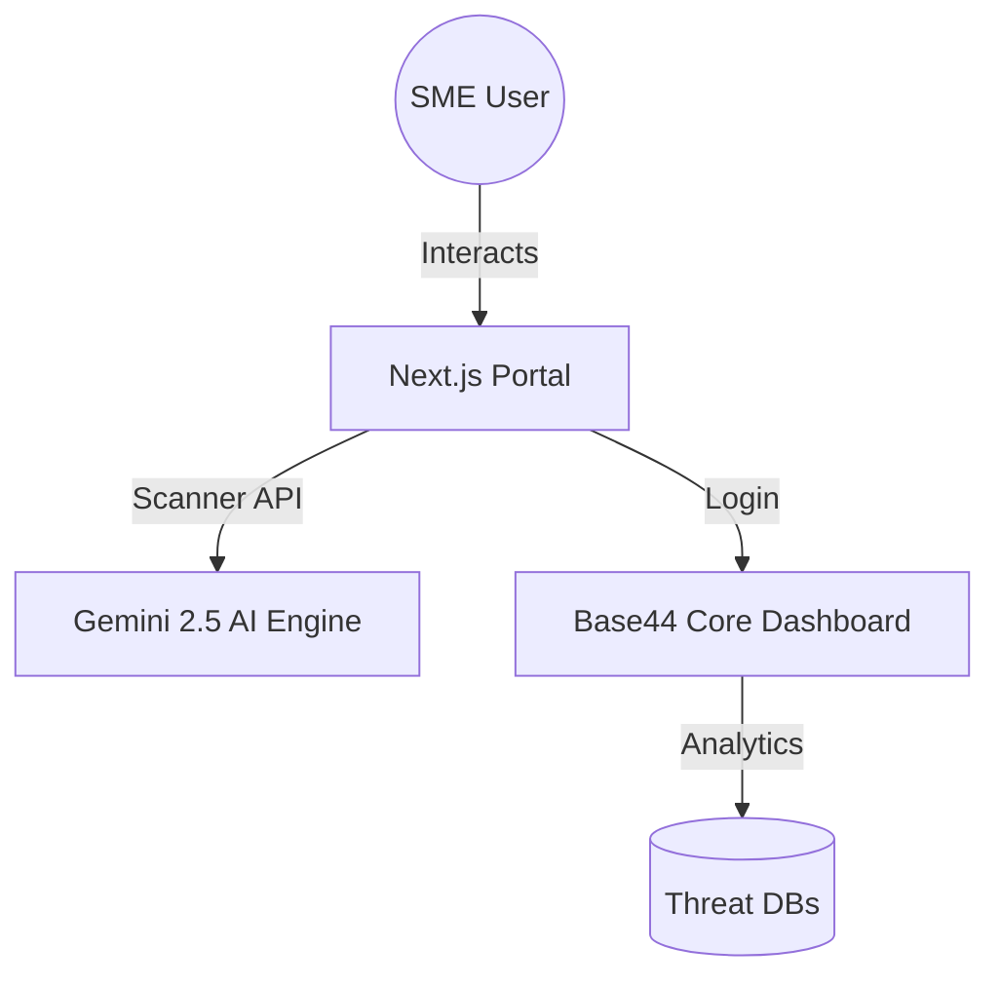

# ZeroT — Leveling the Cybersecurity Playing Field for SMEs 🛡️

ZeroT is a mission-driven, AI-native cybersecurity readiness platform designed specifically for Small and Medium Enterprises (SMEs). We bridge the "Security Gap" for businesses that cannot afford a dedicated SOC (Security Operations Center) but face enterprise-level threats.

> [!IMPORTANT]
> **ZeroT provides the clarity SMEs need to respond to cyber threats with confidence, turning uncertainty into actionable readiness.**

## 🚀 Live Demo
**[Launch ZeroT MVP](https://zerot.vercel.app)**

---

## 💎 The Problem & Our Solution

| The SME Struggle | The ZeroT Solution |
| :--- | :--- |
| **Ambiguity:** "Is this email a hack or a real invoice?" | **AI Triage:** Instant, plain-language risk assessment. |
| **No Expertise:** Technical jargon causes decision paralysis. | **ZeroT Morphism:** A UI designed for non-technical founders. |
| **Static Data:** Threat data is siloed and hard to find. | **Hybrid Intelligence:** Blending public data (opendata.az) with AI reasoning. |

---

## 🌟 Core Feature Suite

### 📡 Live OSINT Threat Feed
Our homepage features a real-time ticker simulating data from regional and global threat databases. It provides SMEs with context on the active threat landscape in their specific sector/region.

### 🔍 Hybrid Threat Scanner (VirusTotal for SMEs)
Unlike simple blacklists, our scanner uses **Hybrid Intelligence**:
1. **Database Lookup:** Checks Google Safe Browsing, PhishTank, and URLScan.io.
2. **AI Semantic Analysis:** Gemini Pro analyzes the "logic" of the threat (typosquatting, social engineering).
3. **Plain English Report:** Tells the user exactly *why* something is dangerous without the jargon.

### 💬 ZeroT AI Assistant
A built-in Q&A widget that allows team members to ask security questions 24/7. It follows a strict system prompt to avoid hallucinations and stick to proven security frameworks.

---

## 🏗️ Hybrid Architecture (Monorepo)

To ensure high performance for the public-facing site and high security for the internal dashboard, ZeroT uses a **Separation of Concerns** architecture:

- **Frontend/Intake (Root):** Built with **Next.js 15**, hosted on **Vercel**. Handles the Landing Page, OSINT Feed, and the Threat Scanner.
- **Core Dashboard (`base44-core/`):** A secure **React 18 + Vite** application. This is where authenticated users (SME Founders) manage their Readiness Score, view incident logs (Response Tasks), and read their Weekly Risk Briefs.



---

## 🛠️ Technology Stack

- **Core:** Next.js 15, React 18, TypeScript.
- **Styling:** Tailwind CSS v4 (ZeroT Morphism Design System).
- **Intelligence:** Google Gemini 2.5 (Flash & Flash-Lite).
- **Tooling:** Vite, ESLint, PostCSS.
- **Infrastructure:** Vercel (Auto-deploy), GitHub (Monorepo).

---

## 🗺️ Roadmap (Future Enhancements)

- [ ] **Incident Response Playbooks:** Automatically generated checklists based on the specific type of threat detected.
- [ ] **Team Accountability Tracking:** Assign response tasks to specific employees and monitor completion.
- [ ] **Founder Weekly Briefs:** Proactive, AI-generated email summaries for busy leaders.
- [ ] **Automated Phishing Simulations:** Training modules to help SMEs train their staff against social engineering.

---

## 📁 Documentation & Pitch Deck

- 📄 **[ZeroT Pitch Deck (PDF)](docs/Zero-Threat-Shield.pdf)** – Detailed overview of our value proposition, target market, and product demonstration. (Video demonstration included in the presentation).

---

## ⚙️ Local Development

1. **Clone & Install:**
   ```bash
   git clone https://github.com/aliyev-toghrul/ZeroT.git
   cd ZeroT
   npm install
   ```
2. **Setup Env:** Create `.env.local` with `GEMINI_API_KEY` and `NEXT_PUBLIC_LOGIN_URL`.
3. **Run:** `npm run dev`.

## 📜 License
Copyright © 2026 ZeroT. Built for the SME community.
